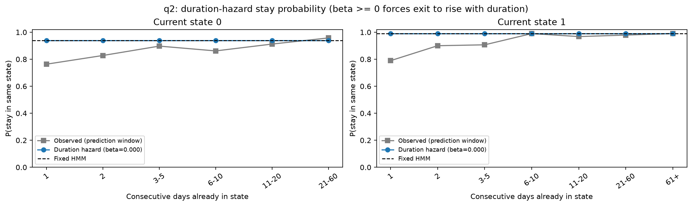
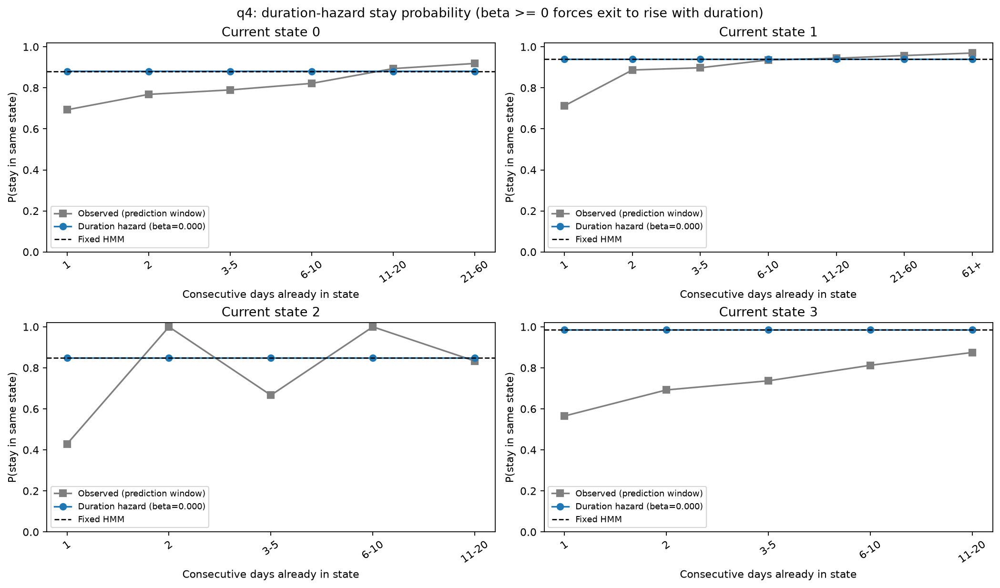
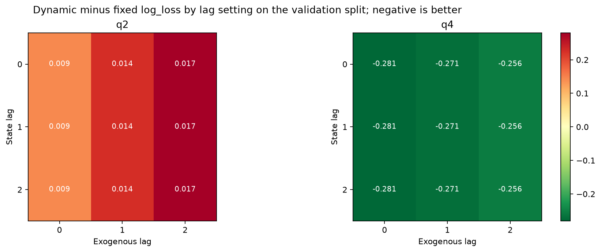
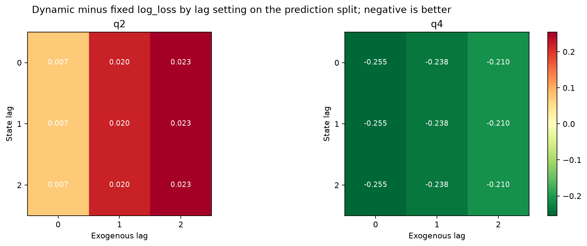

# WorldQuant Capstone: HMM-WGAN Stock Market Simulator

This repository contains a Python implementation of an HMM-WGAN stock market simulator inspired by the Quantitative Finance paper:

**"Stock market simulator using hidden Markov generative model and its application in risk measurement"**

Project members:

- Co Nguyen
- Hieu Ha
- Nam Hoang

The model combines:

- **Hidden Markov Models (HMM)** to identify hidden market regimes, called "market painters" in the paper.
- **Wasserstein GAN with gradient penalty (WGAN-GP)** to learn and simulate stock-return distributions inside each market regime.
- **Stylized-fact and risk-management diagnostics** to compare simulated returns with real market behavior.

## Project Goal

The project tries to simulate realistic multivariate stock returns. The core idea is:

```text
market index returns -> HMM market regimes -> WGAN by regime -> simulated stock returns -> risk and stylized-fact checks
```

Instead of training one generator on all historical market days, the project first separates days into hidden regimes. For example, calm risk-on periods and stress/risk-off periods should not be treated as the same type of market environment.

## Pipeline Overview

| Phase | Script | Purpose |
|---|---|---|
| Data preparation | `p0_1_raw_to_rets.py` | Converts raw prices into log returns for exogenous indexes and stocks. |
| HMM candidate search | `p1_0_hmm_params.py` | Trains many HMM candidates with different random seeds. |
| HMM model selection | `p1_1_best_params.py` | Selects the best HMM seed for each regime setup. |
| HMM labeling | `p1_2_hmm.py` | Fits final HMMs, labels each day with a `STATE`, and saves transition matrices. |
| HMM diagnostics | `p1_7_hmm_diagnostics.py` | Compares diagnostic q2/q3/q4 models on one common feature set using fit, residual, bootstrap regime-count, and regime-stability tests. |
| WGAN training | `p2_2_wgan.py` | Trains WGAN generators by market regime and rolling window. |
| Simulation | `p3_0_sims.py` | Simulates future regimes and stock returns. |
| Univariate diagnostics | `p3_1_stat_prop.py` | Checks stylized facts such as autocorrelation, heavy tails, volatility clustering, leverage, and gain/loss asymmetry. |
| Multivariate diagnostics | `p3_2_stat_prop_mv.py` | Checks correlation, eigenvalues, MST node degree, and heatmaps. |
| Risk management | `p3_3_risk_man.py` | Compares normal-model VaR and HMM-WGAN VaR. |
| Full orchestration | `p0_0_orchestration.py` | Runs the full pipeline. This can be very expensive. |

## HMM Phase In Plain Language

The HMM phase is the regime-labeling engine.

It reads exogenous market returns such as:

- `SPXT`: S&P 500 total return
- `DBLCIX`: Commodity index
- `IBOXIG`: Investment-grade corporate credit
- `JPEICORE`: Emerging-market credit
- `LT11TRUU`: Long Treasury bonds
- `LBUTTRUU`: Inflation-linked bonds

Then it learns hidden regimes:

```text
observed exogenous returns -> hidden STATE
```

For `N_STATES = 2`, the code uses `SPXT` and `LT11TRUU`.

For `N_STATES = 4`, the code uses all six exogenous indexes.

The output is stock-return data with an added `STATE` column:

```text
DATE, STOCK_A, STOCK_B, ..., STATE
```

Later, WGAN trains separate generators for each state.

## What Was Improved From The Original Code

The original code was useful research code, but several parts made it hard to reproduce, move, or audit. This version improves project structure and the HMM model-selection logic.

| Area | Original Code | Improved Code | Benefit |
|---|---|---|---|
| Project paths | Hard-coded `D:\Finance\WQ_Capstone-main\WQ_Capstone-main` in many scripts. | Added `project_config.py` with `BASE_DIR = Path(__file__).resolve().parent`. | Code can run from a different folder without manually editing scripts. |
| Dependencies | No dependency file. | Added `requirements.txt`. | Easier setup with one install command. |
| README | Minimal instructions only. | Expanded README with project explanation, pipeline map, setup, and verification steps. | Improvements are visible directly on GitHub. |
| HMM convergence | Used last likelihood movement to mark convergence. | Uses `hmm.monitor_.converged`. | More correct use of `hmmlearn` convergence status. |
| HMM best-parameter selection | Used a risky `while len(params) > 0` loop and returned many tied rows. | Uses explicit filtering and deterministic sorting. | Safer, clearer, and reproducible. |
| HMM selected output | Old selector could return thousands of "best" rows. | New selector returns one best row per HMM setup. | Downstream code no longer silently depends on row order. |
| Benchmarking | No benchmark for HMM selection behavior. | Added `benchmark_hmm_selection.py`. | You can compare old vs new selection logic without retraining HMMs. |
| Git tracking | Generated files could be accidentally committed. | Added `.gitignore`. | Keeps GitHub focused on code instead of large data/model outputs. |

Current improved HMM selection output:

```csv
N_STATES,SEED,MIN_COUNT
2,607953,304
4,46920,41
```

The benchmark on the existing `phase_1/hmm_params.csv` showed:

```text
Old selector rows: 2591
New selector rows: 2
```

This does not change the HMM-WGAN method from the publication. It makes the implementation more deterministic and easier to defend.

## HMM Regime-Count And Goodness-Of-Fit Diagnostics

The production q2 HMM uses `SPXT` and `LT11TRUU`, while production q4 uses all six exogenous return series. Their likelihoods, AIC, and BIC therefore cannot be compared directly because the observed data dimensions differ. `p1_7_hmm_diagnostics.py` leaves those production models unchanged and independently fits diagnostic q2, q3, and q4 full-covariance Gaussian HMMs to the same standardized six-series training sample.

Run the diagnostics after `processed/exog_rets.csv` has been created:

```powershell
python p1_7_hmm_diagnostics.py
```

The default run uses 50 multistart fits per regime count and 100 parametric-bootstrap replications. A smaller smoke run can verify the pipeline, but should not be used for the final 5% bootstrap decision:

```powershell
python p1_7_hmm_diagnostics.py --starts 5 --bootstrap-replicates 10 --bootstrap-starts 1
```

Outputs are written to `phase_1/`:

| Output | Interpretation |
|---|---|
| `hmm_diagnostic_multistart.csv` | Convergence, state occupancy, likelihood, AIC, and BIC for every random initialization. |
| `hmm_gof_summary.csv` | Comparable q2/q3/q4 AIC, BIC, approximate ICL, train/validation/prediction likelihood, posterior entropy, and minimum regime separation. |
| `hmm_residual_diagnostics.csv` | Marginal one-step PIT uniformity, Ljung-Box tests on PIT normal scores and their squares at lags 10/20, and ARCH LM tests by feature and holdout split. |
| `hmm_regime_stability.csv` | Per-regime occupancy, expected duration, transition-homogeneity test, emission-mean stability test, and explicit instability reasons. |
| `hmm_covariance_diagnostics.csv` | Per-regime covariance eigenvalues, condition numbers, positive-definiteness, and numerical-stability flags. |
| `hmm_emission_normality.csv` | Per-regime and per-feature Jarque-Bera tests of Gaussian emissions, including within-regime Bonferroni decisions. |
| `hmm_duration_geometric_diagnostics.csv` | Bootstrap tests comparing complete inferred state spells with HMM-implied geometric durations. |
| `hmm_regime_count_bootstrap.csv` | Parametric-bootstrap likelihood-ratio tests for q2 versus q3 and q3 versus q4. |
| `hmm_regime_count_recommendation.csv` | Side-by-side support from BIC, ICL, validation likelihood, bootstrap LRT, and regime-stability flags. |
| `hmm_diagnostic_run_config.csv` | Exact dates, features, standardization, random seed, multistart count, and bootstrap settings. |
| `hmm_diagnostics_model_selection.png` | Visual comparison of fit, separation, and instability across q2/q3/q4. |
| `hmm_diagnostics_assumption_checks.png` | Visual summary of covariance conditioning, Gaussian-emission rejections, residual volatility clustering, and geometric-duration tests. |

For the bootstrap LRT, the null hypothesis is that the lower-regime model generates the data and the additional regime is not required. The ordinary chi-square LRT is not used because regime-count testing in HMMs involves unidentified parameters and boundary cases. A non-significant bootstrap result means there is insufficient evidence to add the regime; it does not prove that the lower-regime model is true.

The stability report flags a regime when it is rare, has an expected duration below two days, has changing outgoing transition probabilities across three training subperiods, has a changing emission mean between training halves, or cannot be tested because too few observations are available. These p-values are diagnostics on inferred states and should be interpreted together with economic meaning, occupancy, and out-of-sample likelihood.

The covariance diagnostic uses a condition-number threshold of `1e8`; a covariance must also be finite and positive definite to be marked stable. The Jarque-Bera report preserves nominal 5% decisions and adds a Bonferroni-adjusted decision across the six emission features within each regime. The geometric-duration test excludes the left- and right-censored boundary spells and uses a parametric bootstrap against the fitted HMM self-transition probability.

## Dynamic Transition Experiment - HMM Only

The capstone extension proposes improving only the regime-transition layer first, without touching WGAN. To keep this clean, the new transition experiment is separated into its own modules.

| New File | Responsibility | Comparison To Baseline |
|---|---|---|
| `p1_3_transition_features.py` | Builds supervised transition features from HMM states, exogenous-return lags, regime duration, and state-duration interactions. | The old code used only the current regime and the fixed HMM transition matrix. |
| `p1_4_dynamic_transition.py` | Trains and evaluates a dynamic multinomial logistic transition model. | Compares dynamic `P(q[t+1] | features at t)` against fixed `A[q[t]]`. |
| `p1_4_mlg_transition.py` | Independently selects a regularized multinomial logistic GAM (MLG), applies train-only 5% joint term tests, and plots selected partial effects. | Adds nonlinear transition effects without changing the fixed HMM or MLR calibration paths. |
| `benchmark_dynamic_transition.py` | Runs the HMM-only benchmark for `q2` and `q4`. | Produces fixed-vs-dynamic metrics without retraining WGAN. |
| `p1_5_transition_comparison.py` | Creates transition-matrix comparison tables and graphs. | Visualizes observed transitions, fixed HMM transitions, dynamic average transitions, and metric differences. |
| `p1_6_duration_hazard.py` | Fits a duration-hazard scheme where exit probability is forced to rise with time spent in a regime. | Tests the "regimes age" hypothesis against the fixed HMM. |

This experiment evaluates only regime transitions:

```text
current regime + lagged regimes + exogenous returns + duration
-> predicted next regime
```

It does **not** train WGAN, load WGAN weights, or generate synthetic stock returns.

### Train, Validation, And Prediction Windows

Every transition model is evaluated with the same explicit date-based split. The train cutoff matches `TRAIN_DATE` in `p1_2_hmm.py`, so the fixed HMM and every new model carry exactly the same information set. Nothing after the train cutoff is used for fitting, and the prediction window is never used for fitting or model selection.

| Split | Dates | Rows (q4) | Used For |
|---|---|---:|---|
| Train | 2000-01-03 to 2009-06-01 | 2,318 | Fitting the fixed HMM (Baum-Welch), the dynamic logit, and the hazard betas. |
| Validation | 2009-06-02 to 2016-12-30 | 1,890 | Selecting the lag configuration of the dynamic logit. Nothing else. |
| Prediction | 2017-01-03 to 2023-12-05 | 1,730 | The final out-of-sample comparison reported below. |

Every row of every report CSV carries a `SPLIT` column plus `SPLIT_START` and `SPLIT_END` dates, so it is always visible which window a metric belongs to.

### Model 1: Dynamic Multinomial Logit

`p1_4_dynamic_transition.py` fits a standardized multinomial logistic regression on the train window using state dummies, lagged exogenous returns, regime duration, and duration-state interactions. Class weighting is **not** used: an earlier version used `class_weight='balanced'`, which inflated rare-regime transition probabilities by up to 20x versus observed frequencies and made the Brier score worse than the fixed baseline. Removing it fixed calibration.

Run:

```powershell
python benchmark_dynamic_transition.py
```

Result on the prediction window (2017-2023, out-of-sample for both models, lags chosen on validation only):

| Setup | Metric | Fixed HMM | Dynamic Logit | Interpretation |
|---|---|---:|---:|---|
| `q2` | Log-loss | `0.181` | `0.187` | No improvement for the 2-state HMM. |
| `q4` | Log-loss | `0.752` | `0.497` | Clear improvement in next-regime probability quality. |
| `q4` | Accuracy | `0.874` | `0.872` | Essentially tied. |
| `q4` | Brier score | `0.226` | `0.227` | Essentially tied; calibration is healthy. |

The lag grid also shows that lagged state dummies add nothing (identical log-loss for `STATE_LAG` 0, 1, 2): the predictive signal comes from duration and same-day exogenous returns.

### Model 1B: Regularized Multinomial Logistic GAM

`p1_4_mlg_transition.py` fits MLG independently of the MLR. Continuous predictors use cubic B-spline terms; state indicators remain identifiable linear categorical terms. Smooths use a second-difference P-spline penalty, and the smoothing strength (`C`, reported together with `lambda = 1/C`) and knot count are selected on the validation window using log-loss, Brier score, and accuracy.

Predictor significance is assessed only on the train window. The default `auto` inference mode first uses joint multinomial Wald tests when the unpenalized inference model is stable. If that fit fails, as can happen in sparse q4 regimes with spline-expanded terms, the code switches to a regularized parametric-bootstrap likelihood-ratio screen. The bootstrap screen compares each candidate term with an intercept-only baseline under the penalized MLG fit and reports empirical p-values at the same 5% threshold. The prediction window is not used for p-value screening or model selection.

The MLG report includes `INFERENCE_METHOD`, `BOOTSTRAP_C`, `BOOTSTRAP_REPLICATES`, `TERM_BOOTSTRAP_IMPROVEMENTS`, and `TERM_BOOTSTRAP_VALID_REPLICATES` so it is clear whether a candidate used ordinary Wald inference or the regularized bootstrap fallback.

The benchmark writes a separate MLG report and a selected three-model comparison, so the existing fixed-HMM and MLR report remains unchanged:

```text
phase_1/mlg_transition_report_q2.csv
phase_1/mlg_transition_report_q4.csv
phase_1/mlg_selected_significance_q2.csv
phase_1/mlg_selected_significance_q4.csv
phase_1/transition_model_comparison_q2.csv
phase_1/transition_model_comparison_q4.csv
```

`p1_5_transition_comparison.py` additionally writes fixed-vs-MLR-vs-MLG out-of-sample matrices and metrics. One centered log-odds partial-effect plot is written for every predictor retained by the selected MLG, with the plotted values also saved to CSV:

```text
phase_1/transition_comparison/transition_matrix_summary_mlg.csv
phase_1/transition_comparison/transition_matrix_comparison_mlg_q2.png
phase_1/transition_comparison/transition_matrix_comparison_mlg_q4.png
phase_1/transition_comparison/transition_selected_oos_metrics_q2.csv
phase_1/transition_comparison/transition_selected_oos_metrics_q2.png
phase_1/transition_comparison/transition_selected_oos_metrics_q4.csv
phase_1/transition_comparison/transition_selected_oos_metrics_q4.png
phase_1/transition_comparison/feature_importance_mlr_q2.csv
phase_1/transition_comparison/feature_importance_mlr_q2.png
phase_1/transition_comparison/feature_importance_mlg_q2.csv
phase_1/transition_comparison/feature_importance_mlg_q2.png
phase_1/transition_comparison/feature_importance_mlr_q4.csv
phase_1/transition_comparison/feature_importance_mlr_q4.png
phase_1/transition_comparison/feature_importance_mlg_q4.csv
phase_1/transition_comparison/feature_importance_mlg_q4.png
phase_1/transition_comparison/mlg_partial_effects_q2/
phase_1/transition_comparison/mlg_partial_effects_q4/
```

MLR feature importance is the coefficient norm after the model's standardization step. MLG term importance is the coefficient norm across the selected penalized spline or categorical basis columns. These rankings are intended to compare features within each selected model, not to compare coefficient magnitudes directly between MLR and MLG.

### Model 2: Duration-Hazard Scheme (Rejected By The Data)

`p1_6_duration_hazard.py` tests the economic intuition that regimes "age": the longer the market has stayed in a regime, the more likely it should be to exit. The scheme keeps the fixed HMM matrix as the base and adds a hazard on the diagonal:

```text
logit(P_stay(state i, duration d)) = logit(P_ii_fixed) - beta_i * ln(d),  beta_i >= 0
```

`beta_i = 0` recovers the fixed HMM exactly. Betas are fitted by maximum likelihood on the train window only.

Run:

```powershell
python p1_6_duration_hazard.py
```

Result: **the maximum-likelihood fit pushes every beta to the zero boundary** for both `q2` and `q4`, so the best allowed version of the scheme is identical to the fixed HMM. When the constraint is removed as a diagnostic, every state prefers a **negative** beta (q4: -0.26, -0.18, -0.08, -0.14), and forcing positive betas strictly worsens the out-of-sample log-loss (q4 prediction window: `0.752` at beta 0, `0.767` at beta 0.25, `0.828` at beta 0.5).

The reason is visible in the observed data: the empirical probability of staying **rises** with duration in every state (q4 state 0: about 0.73 on day 1 up to about 0.97 after 60+ days). Day-one spells contain many one-day regime flickers that immediately revert, while long-lived spells are the most stable. Daily HMM regime labels therefore show a *decreasing* exit hazard, which is the opposite of the aging intuition, and no `beta >= 0` can fit an upward-sloping stay curve.

Conclusion: duration **is** predictive, but in the direction of persistence, not exit. The dynamic logit exploits this correctly and beats the fixed HMM on `q4`; the imposed rising-exit-hazard scheme cannot beat the fixed HMM because it fights the data. If the practical goal is to prevent unrealistically long simulated regimes in Phase 3, that is better handled with an explicit duration cap in the simulator than by distorting the estimated transition probabilities.

### Reproducing The Comparison Outputs

```powershell
python benchmark_dynamic_transition.py
python p1_5_transition_comparison.py
python p1_6_duration_hazard.py
```

Reports are saved under `phase_1/`:

```text
dynamic_transition_report_q2.csv
dynamic_transition_report_q4.csv
mlg_transition_report_q2.csv
mlg_transition_report_q4.csv
mlg_selected_significance_q2.csv
mlg_selected_significance_q4.csv
transition_model_comparison_q2.csv
transition_model_comparison_q4.csv
duration_hazard_report_q2.csv
duration_hazard_report_q4.csv
duration_hazard_betas.csv
```

Graphs and matrix tables are saved under `phase_1/transition_comparison/`:

```text
transition_matrix_summary.csv
transition_matrix_summary_mlg.csv
duration_hazard_matrix_summary.csv
transition_matrix_fixed_only_q1.png
transition_matrix_comparison_q2.png
transition_matrix_comparison_q4.png
transition_matrix_comparison_mlg_q2.png
transition_matrix_comparison_mlg_q4.png
transition_matrix_hazard_q2.png
transition_matrix_hazard_q4.png
duration_stay_probability_q2.png
duration_stay_probability_q4.png
duration_hazard_stay_q2.png
duration_hazard_stay_q4.png
transition_log_loss_delta_grid_validation.png
transition_log_loss_delta_grid_prediction.png
transition_brier_score_delta_grid_validation.png
transition_brier_score_delta_grid_prediction.png
```

Important: the dynamic models do not have one fixed transition matrix. For comparison, the scripts report the average predicted transition probabilities on the prediction window, grouped by current HMM state.

### HMM Transition Result Snapshots

The full `phase_1/` output folder is ignored by Git because it is generated data. Important result snapshots are copied into `docs/hmm_transition_results/` so they are visible on GitHub.

Summary tables:

```text
docs/hmm_transition_results/transition_matrix_summary.csv
docs/hmm_transition_results/duration_hazard_matrix_summary.csv
docs/hmm_transition_results/duration_hazard_betas.csv
```

Fixed HMM versus dynamic-logit average transition matrices on the prediction window:


Dynamic-logit duration-dependent stay probabilities (prediction window):


Duration-hazard scheme versus observed stay probabilities (the fitted betas are zero, so the hazard curve collapses onto the fixed HMM line while the observed curve rises):





Metric deltas across lag settings (validation is used for selection, prediction is the out-of-sample check):





This is why the extension should be validated at the transition layer before being connected to WGAN.

## Repository Structure

| Path | Description |
|---|---|
| `Inputs/` | Raw input data. Ignored by Git. |
| `processed/` | Processed prices and returns. Ignored by Git. |
| `phase_1/` | HMM outputs. Ignored by Git. |
| `phase_2/` | WGAN training outputs. Ignored by Git. |
| `models/` | WGAN model weights. Ignored by Git. |
| `simulations/` | Simulated returns. Ignored by Git. |
| `stylized_facts/` | Diagnostic plots and text outputs. Ignored by Git. |
| `risk_management/` | VaR outputs. Ignored by Git. |
| `docs/hmm_transition_results/` | GitHub-visible snapshots of selected HMM transition comparison results. |
| `project_config.py` | Shared portable project path configuration. |
| `requirements.txt` | Python dependencies. |
| `benchmark_hmm_selection.py` | Old-vs-new HMM selector benchmark. |
| `p1_5_transition_comparison.py` | HMM transition comparison graph generator. |
| `p1_6_duration_hazard.py` | Duration-hazard transition scheme fit and evaluation. |
| `p1_7_hmm_diagnostics.py` | Diagnostic q2/q3/q4 goodness-of-fit, regime-count, and stability tests. |

Generated data, model weights, PDFs, zip files, virtual environments, and caches are intentionally excluded from Git by `.gitignore`.

## Setup On Windows PowerShell

From the project folder:

```powershell
cd "D:\Finance\WQ_Capstone-main\WQ_Capstone-main"
```

Create and activate an environment:

```powershell
py -m venv .venv
.\.venv\Scripts\Activate.ps1
```

Install dependencies:

```powershell
python -m pip install --upgrade pip
python -m pip install -r requirements.txt
```

If PowerShell blocks environment activation, run:

```powershell
Set-ExecutionPolicy -Scope CurrentUser RemoteSigned
```

Then activate again.

## Recommended Verification Steps

Start with lightweight checks before running the full model.

### 1. Check Python syntax

```powershell
python -m py_compile project_config.py p0_1_raw_to_rets.py p1_0_hmm_params.py p1_1_best_params.py p1_2_hmm.py p1_7_hmm_diagnostics.py benchmark_hmm_selection.py
```

### 2. Verify the HMM selection improvement

This does not retrain all HMMs. It only reads the existing `phase_1/hmm_params.csv`.

```powershell
python benchmark_hmm_selection.py
```

Expected structure:

```text
Filtered HMM candidate rows: ...
Old selector rows: ...
New selector rows: 2
```

### 3. Regenerate best HMM parameters

```powershell
python p1_1_best_params.py
type phase_1\best_params.csv
```

Expected current output:

```csv
N_STATES,SEED,MIN_COUNT
2,607953,304
4,46920,41
```

### 4. Run HMM labeling only

```powershell
python p1_2_hmm.py
```

This regenerates HMM-labeled stock-return files and transition matrices in `phase_1/`.

### 5. Visualize fixed-vs-dynamic transitions

This does not train WGAN. It compares the old fixed HMM transition matrix with the new dynamic transition model.

```powershell
python p1_5_transition_comparison.py
```

Open the generated images in:

```text
phase_1\transition_comparison\
```

## Running The Full Pipeline

The full orchestration is:

```powershell
python p0_0_orchestration.py
```

Warning: this can be very slow and disk-heavy because WGAN training runs over multiple combinations of:

```text
N_STATES = 1, 2, 4
N_STOCKS = 8, 16, 32, 64
```

For development, start with individual scripts and the smallest case first.

## Important Notes

- The HMM phase is improved and documented.
- The WGAN training loop has not yet been optimized.
- The full model may produce different downstream plots if later phases are rerun, because the HMM best seed is now selected deterministically rather than by accidental row order.
- Methodologically, the project still follows the HMM-WGAN framework from the publication.

## GitHub Tracking

This repository is configured to track source code and configuration files, not generated research artifacts.

Useful Git commands:

```powershell
git status
git log --oneline -5
git branch
```

Push the current branch:

```powershell
git push -u origin WQfinalproject
```
