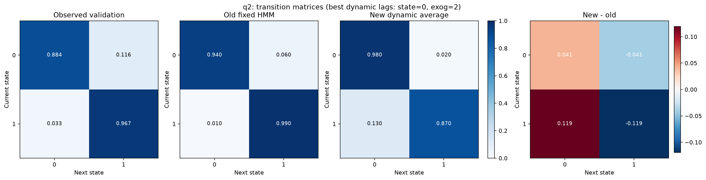
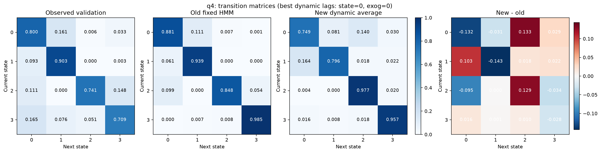
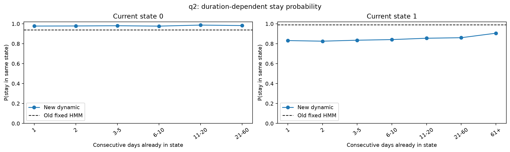
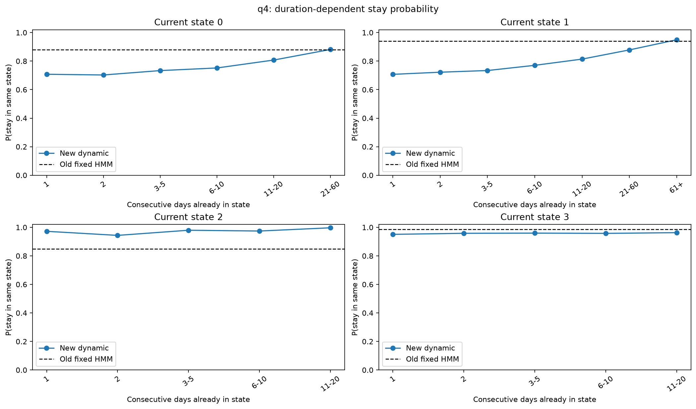
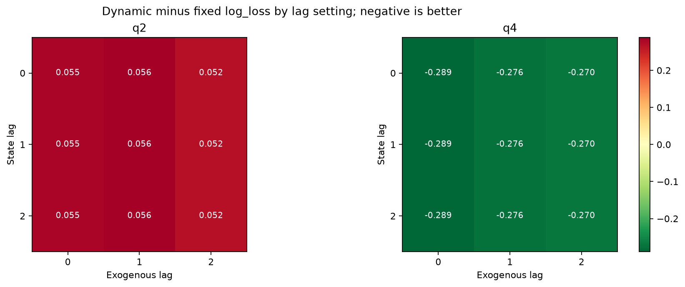
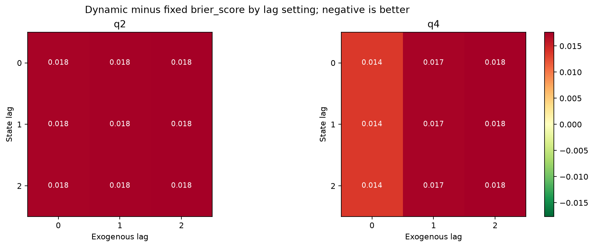

# WorldQuant Capstone: HMM-WGAN Stock Market Simulator

This repository contains a Python implementation of an HMM-WGAN stock market simulator inspired by the Quantitative Finance paper:

**"Stock market simulator using hidden Markov generative model and its application in risk measurement"**

Project members:

- Co Nguyen
- Hieu Ha
- Nam Hoang

The model combines:

- **Hidden Markov Models (HMM)** to identify hidden market regimes, called "market painters" in the paper.
- **Wasserstein GAN with gradient penalty (WGAN-GP)** to learn and simulate stock-return distributions inside each market regime.
- **Stylized-fact and risk-management diagnostics** to compare simulated returns with real market behavior.

## Project Goal

The project tries to simulate realistic multivariate stock returns. The core idea is:

```text
market index returns -> HMM market regimes -> WGAN by regime -> simulated stock returns -> risk and stylized-fact checks
```

Instead of training one generator on all historical market days, the project first separates days into hidden regimes. For example, calm risk-on periods and stress/risk-off periods should not be treated as the same type of market environment.

## Pipeline Overview

| Phase | Script | Purpose |
|---|---|---|
| Data preparation | `p0_1_raw_to_rets.py` | Converts raw prices into log returns for exogenous indexes and stocks. |
| HMM candidate search | `p1_0_hmm_params.py` | Trains many HMM candidates with different random seeds. |
| HMM model selection | `p1_1_best_params.py` | Selects the best HMM seed for each regime setup. |
| HMM labeling | `p1_2_hmm.py` | Fits final HMMs, labels each day with a `STATE`, and saves transition matrices. |
| WGAN training | `p2_2_wgan.py` | Trains WGAN generators by market regime and rolling window. |
| Simulation | `p3_0_sims.py` | Simulates future regimes and stock returns. |
| Univariate diagnostics | `p3_1_stat_prop.py` | Checks stylized facts such as autocorrelation, heavy tails, volatility clustering, leverage, and gain/loss asymmetry. |
| Multivariate diagnostics | `p3_2_stat_prop_mv.py` | Checks correlation, eigenvalues, MST node degree, and heatmaps. |
| Risk management | `p3_3_risk_man.py` | Compares normal-model VaR and HMM-WGAN VaR. |
| Full orchestration | `p0_0_orchestration.py` | Runs the full pipeline. This can be very expensive. |

## HMM Phase In Plain Language

The HMM phase is the regime-labeling engine.

It reads exogenous market returns such as:

- `SPXT`: S&P 500 total return
- `DBLCIX`: Commodity index
- `IBOXIG`: Investment-grade corporate credit
- `JPEICORE`: Emerging-market credit
- `LT11TRUU`: Long Treasury bonds
- `LBUTTRUU`: Inflation-linked bonds

Then it learns hidden regimes:

```text
observed exogenous returns -> hidden STATE
```

For `N_STATES = 2`, the code uses `SPXT` and `LT11TRUU`.

For `N_STATES = 4`, the code uses all six exogenous indexes.

The output is stock-return data with an added `STATE` column:

```text
DATE, STOCK_A, STOCK_B, ..., STATE
```

Later, WGAN trains separate generators for each state.

## What Was Improved From The Original Code

The original code was useful research code, but several parts made it hard to reproduce, move, or audit. This version improves project structure and the HMM model-selection logic.

| Area | Original Code | Improved Code | Benefit |
|---|---|---|---|
| Project paths | Hard-coded `D:\Finance\WQ_Capstone-main\WQ_Capstone-main` in many scripts. | Added `project_config.py` with `BASE_DIR = Path(__file__).resolve().parent`. | Code can run from a different folder without manually editing scripts. |
| Dependencies | No dependency file. | Added `requirements.txt`. | Easier setup with one install command. |
| README | Minimal instructions only. | Expanded README with project explanation, pipeline map, setup, and verification steps. | Improvements are visible directly on GitHub. |
| HMM convergence | Used last likelihood movement to mark convergence. | Uses `hmm.monitor_.converged`. | More correct use of `hmmlearn` convergence status. |
| HMM best-parameter selection | Used a risky `while len(params) > 0` loop and returned many tied rows. | Uses explicit filtering and deterministic sorting. | Safer, clearer, and reproducible. |
| HMM selected output | Old selector could return thousands of "best" rows. | New selector returns one best row per HMM setup. | Downstream code no longer silently depends on row order. |
| Benchmarking | No benchmark for HMM selection behavior. | Added `benchmark_hmm_selection.py`. | You can compare old vs new selection logic without retraining HMMs. |
| Git tracking | Generated files could be accidentally committed. | Added `.gitignore`. | Keeps GitHub focused on code instead of large data/model outputs. |

Current improved HMM selection output:

```csv
N_STATES,SEED,MIN_COUNT
2,607953,304
4,46920,41
```

The benchmark on the existing `phase_1/hmm_params.csv` showed:

```text
Old selector rows: 2591
New selector rows: 2
```

This does not change the HMM-WGAN method from the publication. It makes the implementation more deterministic and easier to defend.

## Dynamic Transition Experiment - HMM Only

The capstone extension proposes improving only the regime-transition layer first, without touching WGAN. To keep this clean, the new transition experiment is separated into its own modules.

| New File | Responsibility | Comparison To Baseline |
|---|---|---|
| `p1_3_transition_features.py` | Builds supervised transition features from HMM states, exogenous-return lags, regime duration, and state-duration interactions. | The old code used only the current regime and the fixed HMM transition matrix. |
| `p1_4_dynamic_transition.py` | Trains and evaluates a dynamic multinomial logistic transition model. | Compares dynamic `P(q[t+1] | features at t)` against fixed `A[q[t]]`. |
| `benchmark_dynamic_transition.py` | Runs the HMM-only benchmark for `q2` and `q4`. | Produces fixed-vs-dynamic metrics without retraining WGAN. |
| `p1_5_transition_comparison.py` | Creates transition-matrix comparison tables and graphs. | Visualizes observed validation transitions, old fixed HMM transitions, new dynamic average transitions, and metric differences. |

This experiment evaluates only regime transitions:

```text
current regime + lagged regimes + exogenous returns + duration
-> predicted next regime
```

It does **not** train WGAN, load WGAN weights, or generate synthetic stock returns.

Run:

```powershell
python benchmark_dynamic_transition.py
```

Outputs are saved under `phase_1/`:

```text
dynamic_transition_report_q2.csv
dynamic_transition_report_q4.csv
```

To visualize how the transition behavior changes:

```powershell
python p1_5_transition_comparison.py
```

Outputs are saved under `phase_1/transition_comparison/`:

```text
transition_matrix_summary.csv
transition_matrix_fixed_only_q1.png
transition_matrix_comparison_q2.png
transition_matrix_comparison_q4.png
duration_stay_probability_q2.png
duration_stay_probability_q4.png
transition_log_loss_delta_grid.png
transition_brier_score_delta_grid.png
```

Important: the dynamic model does not have one fixed transition matrix. For comparison, the script reports the average dynamic transition probabilities on the validation period, grouped by current HMM state.

Initial benchmark result on the existing Phase 1 labels:

| Setup | Fixed HMM Log-Loss | Best Dynamic Log-Loss | Interpretation |
|---|---:|---:|---|
| `q2` | `0.209130` | `0.261071` | Fixed transition is still better on this validation split. |
| `q4` | `0.859193` | `0.570078` | Dynamic transition improves next-regime probability prediction. |

### HMM Transition Result Snapshots

The full `phase_1/` output folder is ignored by Git because it is generated data. Important result snapshots are copied into `docs/hmm_transition_results/` so they are visible on GitHub.

Summary table:

```text
docs/hmm_transition_results/transition_matrix_summary.csv
```

Old fixed HMM versus new dynamic average transition matrices:





Duration-dependent stay probabilities:





Metric deltas across lag settings:





This is why the extension should be validated at the transition layer before being connected to WGAN.

## Repository Structure

| Path | Description |
|---|---|
| `Inputs/` | Raw input data. Ignored by Git. |
| `processed/` | Processed prices and returns. Ignored by Git. |
| `phase_1/` | HMM outputs. Ignored by Git. |
| `phase_2/` | WGAN training outputs. Ignored by Git. |
| `models/` | WGAN model weights. Ignored by Git. |
| `simulations/` | Simulated returns. Ignored by Git. |
| `stylized_facts/` | Diagnostic plots and text outputs. Ignored by Git. |
| `risk_management/` | VaR outputs. Ignored by Git. |
| `docs/hmm_transition_results/` | GitHub-visible snapshots of selected HMM transition comparison results. |
| `project_config.py` | Shared portable project path configuration. |
| `requirements.txt` | Python dependencies. |
| `benchmark_hmm_selection.py` | Old-vs-new HMM selector benchmark. |
| `p1_5_transition_comparison.py` | HMM transition comparison graph generator. |

Generated data, model weights, PDFs, zip files, virtual environments, and caches are intentionally excluded from Git by `.gitignore`.

## Setup On Windows PowerShell

From the project folder:

```powershell
cd "D:\Finance\WQ_Capstone-main\WQ_Capstone-main"
```

Create and activate an environment:

```powershell
py -m venv .venv
.\.venv\Scripts\Activate.ps1
```

Install dependencies:

```powershell
python -m pip install --upgrade pip
python -m pip install -r requirements.txt
```

If PowerShell blocks environment activation, run:

```powershell
Set-ExecutionPolicy -Scope CurrentUser RemoteSigned
```

Then activate again.

## Recommended Verification Steps

Start with lightweight checks before running the full model.

### 1. Check Python syntax

```powershell
python -m py_compile project_config.py p0_1_raw_to_rets.py p1_0_hmm_params.py p1_1_best_params.py p1_2_hmm.py benchmark_hmm_selection.py
```

### 2. Verify the HMM selection improvement

This does not retrain all HMMs. It only reads the existing `phase_1/hmm_params.csv`.

```powershell
python benchmark_hmm_selection.py
```

Expected structure:

```text
Filtered HMM candidate rows: ...
Old selector rows: ...
New selector rows: 2
```

### 3. Regenerate best HMM parameters

```powershell
python p1_1_best_params.py
type phase_1\best_params.csv
```

Expected current output:

```csv
N_STATES,SEED,MIN_COUNT
2,607953,304
4,46920,41
```

### 4. Run HMM labeling only

```powershell
python p1_2_hmm.py
```

This regenerates HMM-labeled stock-return files and transition matrices in `phase_1/`.

### 5. Visualize fixed-vs-dynamic transitions

This does not train WGAN. It compares the old fixed HMM transition matrix with the new dynamic transition model.

```powershell
python p1_5_transition_comparison.py
```

Open the generated images in:

```text
phase_1\transition_comparison\
```

## Running The Full Pipeline

The full orchestration is:

```powershell
python p0_0_orchestration.py
```

Warning: this can be very slow and disk-heavy because WGAN training runs over multiple combinations of:

```text
N_STATES = 1, 2, 4
N_STOCKS = 8, 16, 32, 64
```

For development, start with individual scripts and the smallest case first.

## Important Notes

- The HMM phase is improved and documented.
- The WGAN training loop has not yet been optimized.
- The full model may produce different downstream plots if later phases are rerun, because the HMM best seed is now selected deterministically rather than by accidental row order.
- Methodologically, the project still follows the HMM-WGAN framework from the publication.

## GitHub Tracking

This repository is configured to track source code and configuration files, not generated research artifacts.

Useful Git commands:

```powershell
git status
git log --oneline -5
git branch
```

Push the current branch:

```powershell
git push -u origin WQfinalproject
```
