# WorldQuant Capstone: HMM-WGAN Stock Market Simulator

This repository implements an HMM-WGAN stock-market simulator inspired by the paper **"Stock market simulator using hidden Markov generative model and its application in risk measurement"**. The project separates market history into latent regimes, estimates regime-transition probabilities, trains regime-conditional WGAN generators, and evaluates simulated returns using stylized-fact and risk diagnostics.

Project members:

- Co Nguyen
- Hieu Ha
- Nam Hoang

## Research Workflow

```text
raw prices
-> market and stock returns
-> Gaussian HMM regime calibration
-> HMM diagnostics and regime-count analysis
-> fixed and dynamic transition models
-> regime-conditional WGAN training
-> return simulation
-> stylized-fact and VaR backtesting
```

Phase 1 is the most extensively calibrated and diagnosed part of the current repository. It now contains a fixed HMM transition benchmark and four independently calibrated dynamic transition alternatives:

1. Original multinomial logistic regression (MLR)
2. P-value/VIF-selected MLR
3. Regularized multinomial logistic GAM (MLG)
4. Group-weighted regularized MLG

The original HMM, MLR, and MLG code paths remain available as unchanged benchmarks. New methods are implemented in separate modules and appended to the comparison outputs.

## Pipeline Map

| Phase | Script | Purpose |
|---|---|---|
| Data preparation | `p0_1_raw_to_rets.py` | Converts raw prices to exogenous-index and stock log returns. |
| HMM seed search | `p1_0_hmm_params.py` | Fits production HMM candidates over random seeds. |
| HMM seed selection | `p1_1_best_params.py` | Deterministically chooses one production seed per regime count. |
| Production HMM | `p1_2_hmm.py` | Fits q1/q2/q4 HMMs, assigns states, and saves fixed transition matrices. |
| Transition features | `p1_3_transition_features.py` | Builds the original supervised transition dataset. |
| Original MLR | `p1_4_dynamic_transition.py` | Fits the benchmark dynamic multinomial logistic transition model. |
| Original MLG | `p1_4_mlg_transition.py` | Selects a regularized multinomial logistic GAM with train-only 5% term tests. |
| Weighted MLG | `p1_10_weighted_mlg_transition.py` | Selects a second MLG under group-weighted L2 regularization. |
| P-value/VIF MLR | `p1_11_pvalue_vif_mlr_transition.py` | Builds a corrected full-rank MLR design and selects terms using 5% Wald tests and VIF <= 5. |
| Model comparison | `p1_5_transition_comparison.py` | Produces five-model probability, metric, feature-importance, and matrix comparisons. |
| Duration hazard | `p1_6_duration_hazard.py` | Tests a constrained increasing-exit-hazard specification. |
| HMM diagnostics | `p1_7_hmm_diagnostics.py` | Runs common-feature q2/q3/q4 goodness-of-fit, stability, residual, covariance, and regime-count tests. |
| Transition dynamics | `p1_8_hmm_transition_dynamics.py` | Tests abrupt versus gradual regime changes and hard-state versus soft-posterior forecasts. |
| Feature ablation | `p1_9_transition_feature_ablation.py` | Measures state, market, and duration contribution using ablation and state-conditional block permutation. |
| WGAN training | `p2_2_wgan.py` | Trains regime-conditional WGAN-GP generators. |
| Simulation | `p3_0_sims.py` | Simulates future regimes and stock returns. |
| Stylized facts | `p3_1_stat_prop.py`, `p3_2_stat_prop_mv.py` | Evaluates univariate and multivariate simulated-return properties. |
| Risk backtesting | `p3_3_risk_man.py` | Compares normal and WGAN/HMM-WGAN VaR and exceedances. |
| Full pipeline | `p0_0_orchestration.py` | Runs all phases and parameter combinations. This is computationally expensive. |

## Data And Evaluation Windows

The production and diagnostic workflows use explicit date splits. Model fitting and statistical screening never use the final prediction period.

| Split | Dates | Main use |
|---|---|---|
| Train | 2000-01-03 to 2009-06-01 | HMM estimation, MLR/MLG fitting, p-value screening, and VIF screening. |
| Validation | 2009-06-02 to 2016-12-30 | Lag, knot, global regularization, and group-penalty selection. |
| Prediction/backtest | 2017-01-03 to 2023-12-05 | Untouched out-of-sample transition-probability comparison. |

The common-feature HMM diagnostic prediction sample contains one additional final observation and ends on 2023-12-06. Its exact configuration is stored in `phase_1/hmm_diagnostic_run_config.csv`.

## Phase 1 Methodology

### Production HMM Calibration

The production model is a full-covariance Gaussian HMM estimated by Baum-Welch on the training sample.

- q2 uses `SPXT` and `LT11TRUU`.
- q4 uses `SPXT`, `DBLCIX`, `IBOXIG`, `JPEICORE`, `LT11TRUU`, and `LBUTTRUU`.
- The selected production seeds are q2 `889088` and q4 `490100`.
- Training states use the most likely joint Viterbi path.
- After the training cutoff, each date is assigned from the final state of a trailing 256-observation Viterbi window.

Production q4 state severity, based on state-conditional market-index means, is:

```text
state 3 (most stressed) -> state 1 -> state 2 -> state 0 (most benign)
```

State labels are model-specific identifiers, not ordinal values estimated by the HMM.

### Comparable HMM Regime-Count Diagnostics

Production q2 and q4 likelihoods are not directly comparable because they use different feature sets. `p1_7_hmm_diagnostics.py` therefore fits diagnostic q2, q3, and q4 HMMs to the same six standardized exogenous return series.

The diagnostic procedure uses:

- 50 random starts per regime count
- 100 parametric-bootstrap likelihood-ratio replications
- 500 geometric-duration bootstrap replications
- Train-only mean and population-standard-deviation scaling
- Ascending training-sample SPXT mean for diagnostic state ordering

Regime count is evaluated using BIC, approximate ICL, validation likelihood, parametric-bootstrap LRTs, occupancy, regime separation, numerical conditioning, duration behavior, and stability flags. The bootstrap LRT is used instead of a standard chi-square LRT because HMM regime-count tests involve unidentified parameters and boundary cases.

### Transition Dataset

For a date `t`, the supervised transition target is the inferred HMM state at `t+1`:

```text
current and lagged state information
+ current and lagged market-index returns
+ time already spent in the current state
-> probability vector for next state
```

All predicted probability vectors are aligned to the complete state set and verified to sum to one.

### Fixed Transition Benchmark

The fixed benchmark uses the production HMM transition row associated with the current hard state:

```text
P(q[t+1] | q[t]) = A[q[t], :]
```

It does not react to market-index values or duration once the current state is known.

### Original MLR

`p1_4_dynamic_transition.py` fits standardized multinomial logistic regression with L2 regularization. The lag grid is selected by validation log loss and Brier score, with lower lags as tie-breakers. Class weighting is intentionally not used because balanced class weights previously overpredicted rare transitions and damaged calibration.

The original MLR remains unchanged as a benchmark, including its original feature construction.

### P-Value/VIF-Selected MLR

`p1_11_pvalue_vif_mlr_transition.py` is a separate MLR calibration path that corrects structural design problems without modifying the original MLR:

- State 0 is the reference category, removing the state-dummy trap.
- Global `DURATION` is omitted because it equals the sum of state-specific duration variables exactly.
- Lagged-state dummies are generated correctly rather than becoming zero-valued columns after `shift()` changes integer labels to floating point.
- Whole state-lag groups use joint multinomial Wald tests.
- Individual macro and duration terms use multinomial Wald tests.
- Terms above the 5% p-value threshold are removed by backward selection.
- VIF must be no greater than 5 in the final model.
- A macro is never removed for VIF when its p-value is at or below 5%.
- Eligible lag candidates retain the original validation ranking: log loss, Brier score, state lag, then exogenous lag.

Every removal and its p-value/VIF at removal is saved in a selection-audit CSV.

### Original Regularized MLG

`p1_4_mlg_transition.py` fits multinomial logistic GAM independently of MLR selection.

- State indicators are identifiable categorical terms.
- Continuous variables use cubic B-spline bases.
- Duration is transformed with `log1p` before spline construction.
- A second-difference P-spline roughness penalty is combined with an L2 ridge floor.
- Knot count and global `C` are selected on validation metrics.
- Terms are screened at 5% on training data only.
- Stable designs use joint Wald tests.
- Sparse or unstable designs use a regularized parametric-bootstrap likelihood-improvement screen.

For a duration term `DURATION_STATE_i`, partial-effect plots report only relevant next-state contrasts from current state `i`.

### Group-Weighted MLG

`p1_10_weighted_mlg_transition.py` fits an additional MLG with the following group-weighted penalized objective:

$$
\mathcal{L}(\beta)
= \operatorname{NLL}_{\text{multinomial}}(\beta)
+ \frac{1}{2C}
\left(
w_{\text{state}}\lVert\beta_{\text{state}}\rVert_2^2
+ w_{\text{market}}\lVert\beta_{\text{market}}\rVert_2^2
+ w_{\text{duration}}\lVert\beta_{\text{duration}}\rVert_2^2
\right)
$$

The state penalty is normalized to 1 because common penalty scaling is absorbed by global `C`. Validation searches:

- Market weight: `{0.5, 1}`
- Duration weight: `{1, 2, 4, 8}`
- The original lag, knot, and global-`C` candidates

The weighted model reuses the original train-only 5% significance screen for each architecture, then independently refits and selects coefficients under group-weighted loss. A unit-weight test verifies that weights `{1, 1, 1}` reproduce original MLG probabilities.

## HMM Diagnostic Results

### Regime Count And Goodness Of Fit

All three diagnostic HMMs converged and all covariance matrices were positive definite and numerically stable.

| Diagnostic model | BIC | Approx. ICL | Validation LL/row | Prediction LL/row | Minimum occupancy | Unstable regimes |
|---|---:|---:|---:|---:|---:|---:|
| q2 | 30,369.7 | 30,785.3 | -6.5884 | -6.4527 | 21.66% | 2 of 2 |
| q3 | 29,366.1 | 29,907.7 | **-6.5508** | **-6.3803** | 9.66% | 3 of 3 |
| q4 | **28,936.2** | **29,373.8** | -6.6007 | -6.4611 | 11.13% | 3 of 4 |

The evidence is mixed:

- BIC and ICL favor q4.
- Validation and prediction likelihood per row favor q3.
- Bootstrap LRT rejects q2 in favor of q3 (`p = 0.0099`).
- Bootstrap LRT rejects q3 in favor of q4 (`p = 0.0396`).
- The combined rule recommends q4 with support from BIC, ICL, and bootstrap LRT.
- Stability diagnostics warn that transition distributions change over training subperiods for most inferred regimes.

The q4 recommendation is therefore statistical support for an additional regime, not evidence that a stationary Gaussian q4 HMM is fully specified.

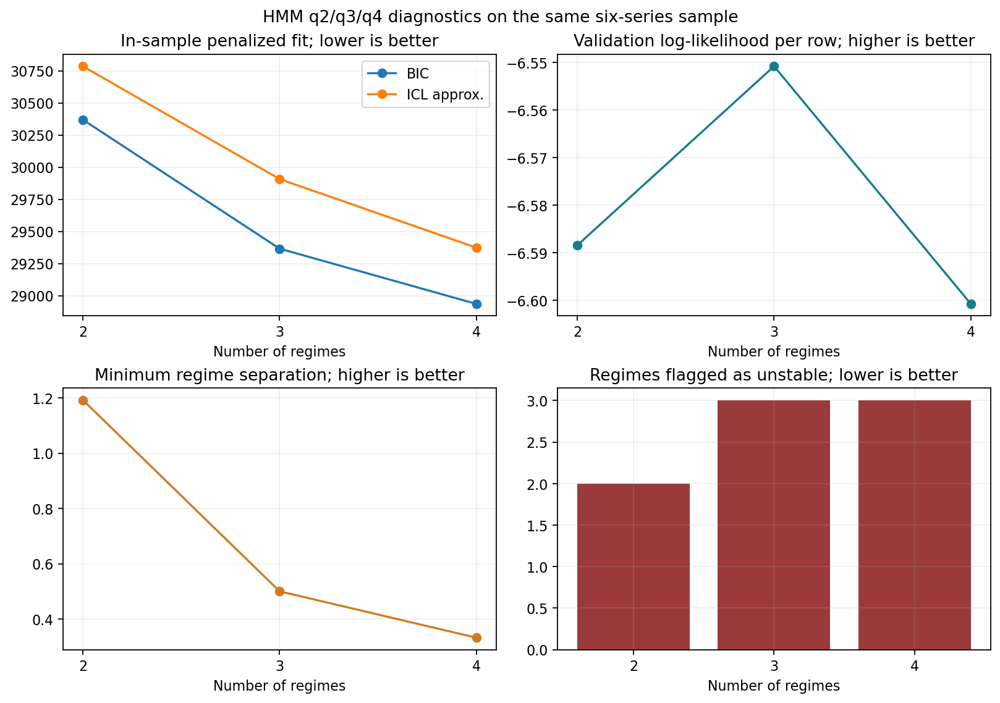

### Assumption And Stability Checks

| Diagnostic | Key result | Interpretation |
|---|---|---|
| Covariance condition number | Maximum is 89.1, far below the `1e8` threshold. | No numerical covariance instability for q2/q3/q4. |
| Gaussian emissions | Bonferroni rejects 12/12 q2, 12/18 q3, and 14/24 q4 regime-feature distributions. | Gaussian conditional emissions do not capture heavy tails and skewness well. |
| One-step PIT uniformity | All six features fail in validation and prediction for q2/q3/q4. | Marginal predictive distributions remain misspecified. |
| Residual volatility | All six features fail the no-volatility-clustering test in every holdout/model combination. | Conditional heteroskedasticity remains after the Gaussian HMM. |
| Geometric duration | q2 rejects both regimes; q3 rejects none; q4 rejects 1 of 4. | Duration dependence is strongest evidence against q2's memoryless transition assumption. |
| Transition stability | q2, q3, and most q4 regimes change across training subperiods. | A fixed transition matrix is too restrictive as a complete transition model. |

These diagnostics motivate dynamic transition probabilities and regime-conditional generative models, while also cautioning against treating hard HMM labels as perfectly observed truth.

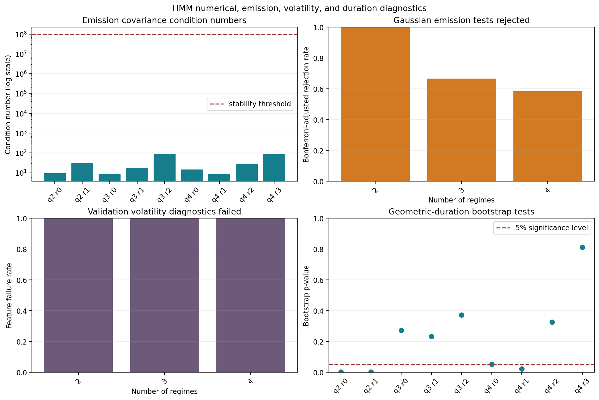

## Transition-Dynamics Diagnostics

`p1_8_hmm_transition_dynamics.py` reconstructs the production HMMs, verifies a 100% state-label match, exports one-sided filtered posteriors, and studies transition events from day -10 through day +10.

Posterior ambiguity is more common under q4:

| Model | Mean maximum posterior | Share below 0.80 | Share below 0.60 |
|---|---:|---:|---:|
| q2 | 0.9329 | 12.71% | 3.72% |
| q4 | 0.8919 | 21.89% | 6.87% |

No reliable q2 or q4 transition pair supports a monotonic pre-transition destination-probability buildup at 5% after FDR adjustment. Frequent q4 transitions often fluctuate and then jump rather than following a common smooth ramp. Rare stress-entry pairs can appear abrupt, but their event counts are small.

Rolling 5-day and 20-day means and standard deviations provide limited additional evidence:

- q2 has two FDR-significant 20-day shifts.
- q4 has no FDR-significant rolling-moment shift among reliable tests.

The evidence does not support imposing one fixed transition window before a hard state change.

### Hard State Versus Soft Posterior

Soft current-state probabilities materially improve q4 one-step probability forecasts even when the transition matrix itself remains fixed.

| q4 prediction model | Log loss | Brier | Accuracy |
|---|---:|---:|---:|
| Hard state, fixed matrix | 0.4343 | 0.2083 | **0.8855** |
| Soft posterior, fixed matrix | 0.3357 | 0.1822 | 0.8809 |
| Hard state, Jeffreys-smoothed matrix | 0.4376 | 0.2114 | **0.8855** |
| Soft posterior, Jeffreys-smoothed matrix | **0.3306** | **0.1805** | 0.8798 |

Block-bootstrap confidence intervals for q4 soft-minus-hard log loss and Brier score are entirely below zero in validation and prediction. q2 evidence is weaker because q2 posteriors are already more concentrated.

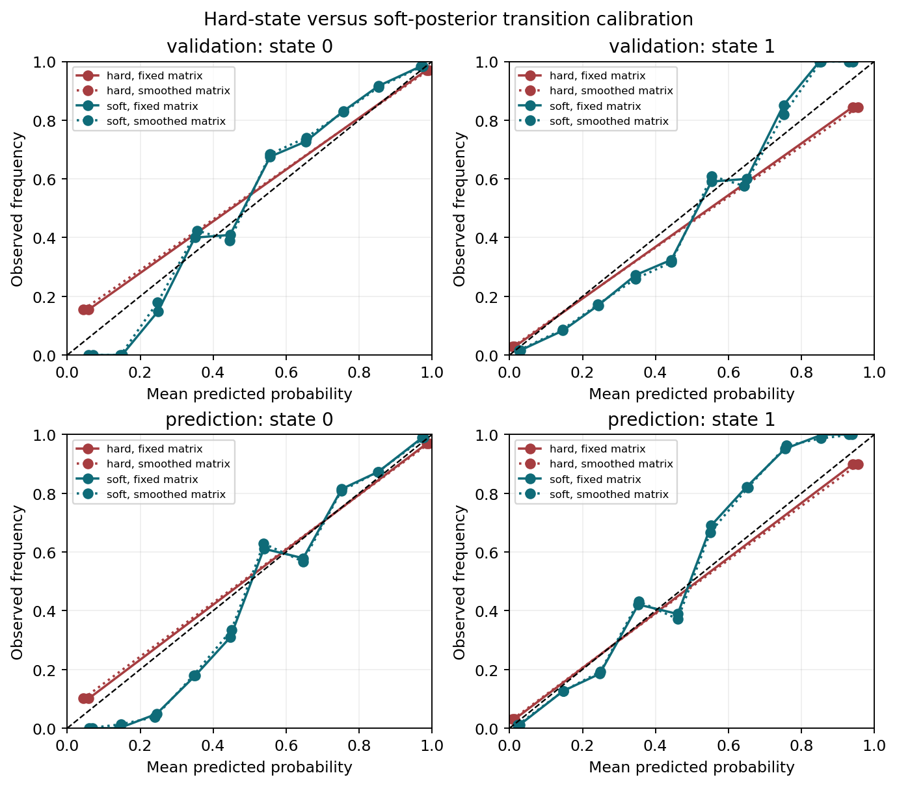

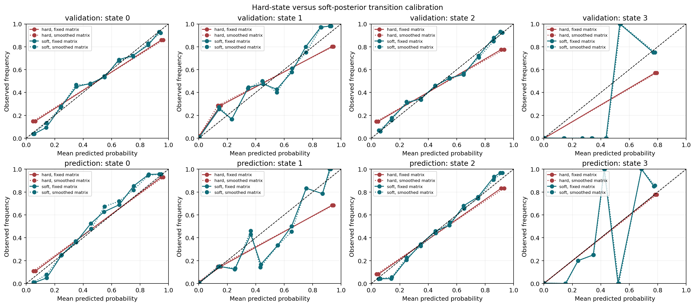

## Feature-Ablation Results

`p1_9_transition_feature_ablation.py` compares state-only, state-plus-market, state-plus-duration, restricted-duration, and full specifications. It also performs 199 joint block permutations within current state.

Main findings:

- Duration contains material out-of-sample information for both MLR and MLG.
- Duration permutation raises log loss in every q2/q4 model and split, with duration confidence intervals above zero.
- The market block adds little aggregate information after state and duration are included.
- A single global linear `log1p(duration)` term performs materially worse than state-specific nonlinear duration.
- q4 MLR improves when the market block is removed, while q4 MLG receives only a small validation benefit from market variables.

This evidence supports regularizing duration rather than deleting it and motivates the group-weighted MLG as an alternative specification.

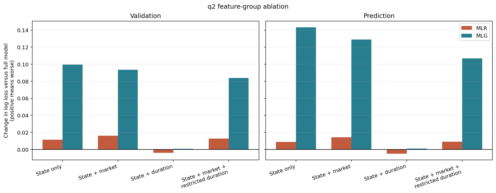

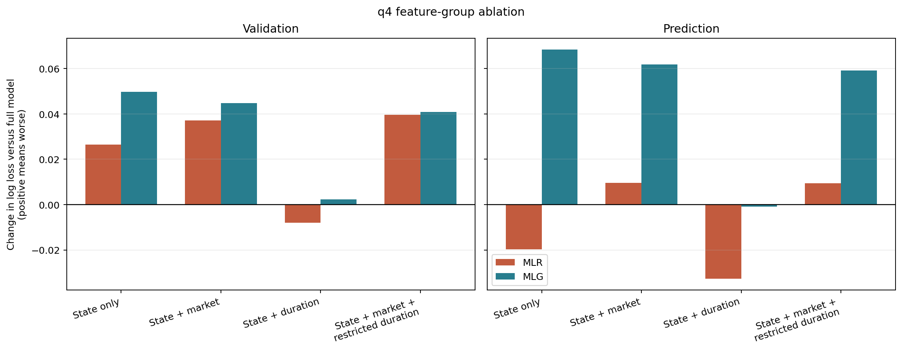

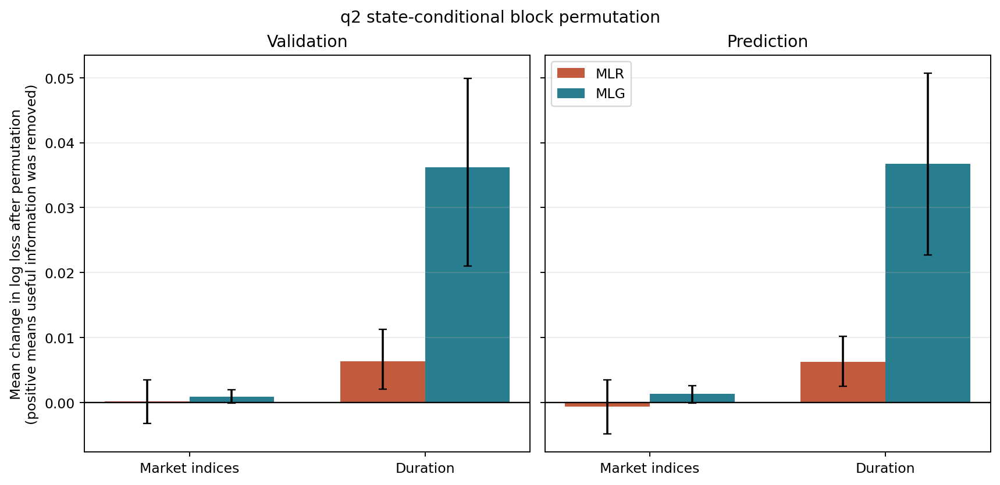

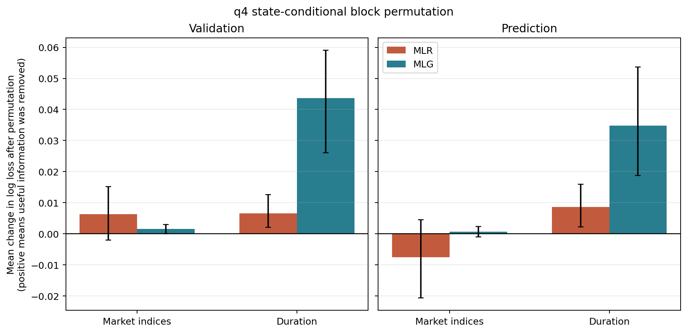

## Transition Backtest Results

The prediction period from 2017-01-03 through 2023-12-05 is an untouched probability backtest. It is not a trading-strategy P&L backtest.

| Regimes | Model | Log loss | Brier score | Accuracy |
|---|---|---:|---:|---:|
| q2 | Fixed HMM | 0.19115 | 0.08979 | **0.95260** |
| q2 | Original MLR | 0.19274 | 0.09003 | **0.95260** |
| q2 | P/VIF MLR | 0.19172 | 0.09023 | **0.95260** |
| q2 | Original MLG | 0.17240 | 0.08926 | 0.95202 |
| q2 | Group-weighted MLG | **0.17000** | **0.08730** | 0.95202 |
| q4 | Fixed HMM | 0.43912 | 0.20827 | **0.88555** |
| q4 | Original MLR | 0.46066 | 0.21621 | 0.88035 |
| q4 | P/VIF MLR | 0.44028 | 0.20892 | **0.88555** |
| q4 | Original MLG | **0.40752** | **0.20498** | 0.87746 |
| q4 | Group-weighted MLG | 0.40809 | 0.20529 | 0.87688 |

Interpretation:

- Group-weighted MLG is the strongest q2 probability model.
- Original MLG is marginally stronger than weighted MLG for q4 prediction, despite weighted MLG's slightly better validation result.
- P/VIF MLR substantially improves q4 over original MLR and nearly matches the fixed model.
- MLG variants improve q4 probability quality but not hard classification accuracy.
- Accuracy is dominated by high stay probabilities and should not be used alone for model selection.

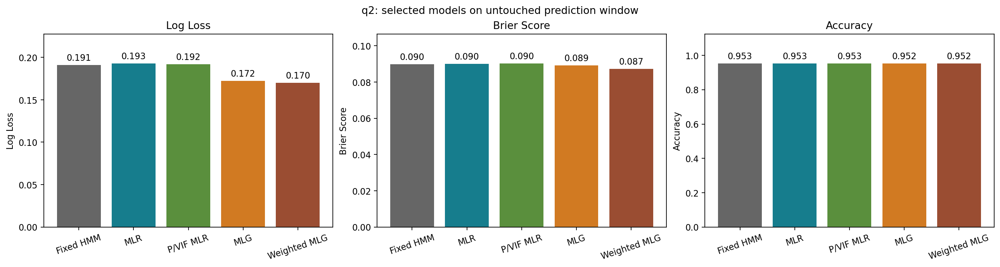

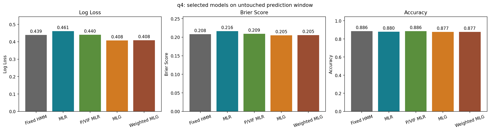

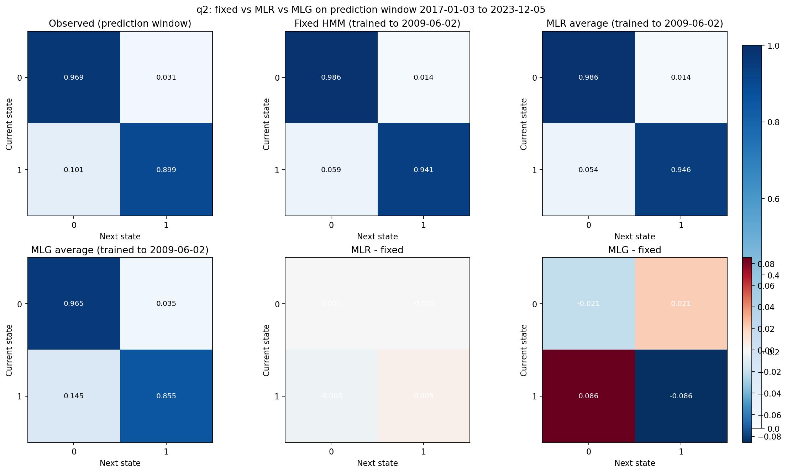

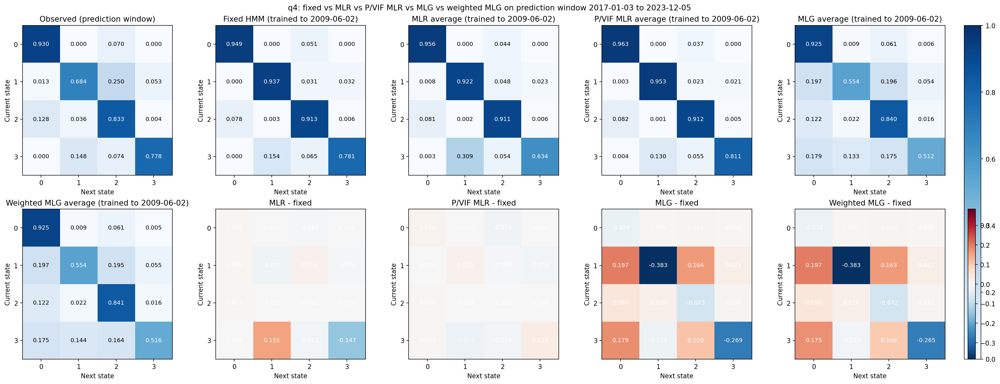

### Selected Dynamic Specifications

| Model | q2 selected specification | q4 selected specification |
|---|---|---|
| Original MLR | State lag 1, exogenous lag 0 | State lag 0, exogenous lag 0 |
| P/VIF MLR | `STATE_LAG_0`, `DURATION_STATE_0`; max p = 0.01585, max VIF = 1.166 | `STATE_LAG_0`, `DBLCIX_LAG_1`, `DURATION_STATE_2`; max p = 0.01170, max VIF = 1.705 |
| Original MLG | State lag 0, exogenous lags through 2, 6 knots, `C=0.01` | State lag 0, exogenous lag 0, 6 knots, `C=0.01` |
| Weighted MLG | State weight 1, market weight 0.5, duration weight 8, `C=0.1` | State weight 1, market weight 0.5, duration weight 1, `C=0.01` |

Weighted coefficient-norm allocation changes in the intended direction but should not be interpreted causally:

| Regimes | Model | Market | Duration | State |
|---|---|---:|---:|---:|
| q2 | Original MLG | 28.34% | 61.22% | 10.43% |
| q2 | Weighted MLG | 56.82% | 18.54% | 24.64% |
| q4 | Original MLG | 20.61% | 66.35% | 13.04% |
| q4 | Weighted MLG | 28.40% | 59.84% | 11.76% |

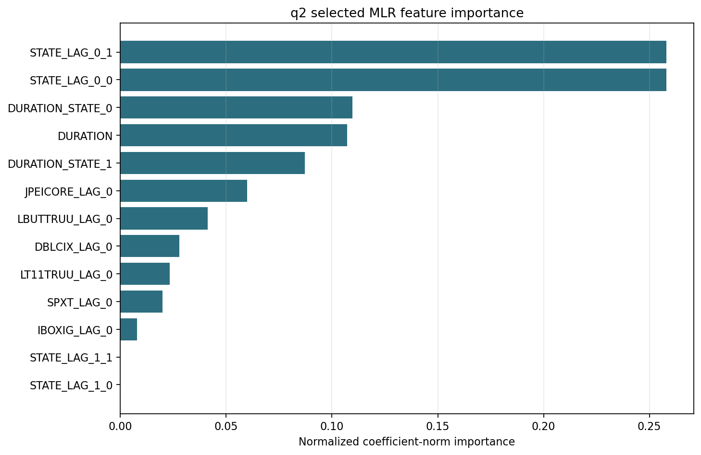

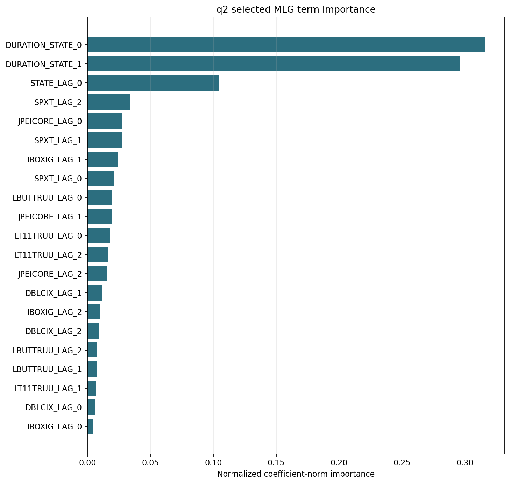

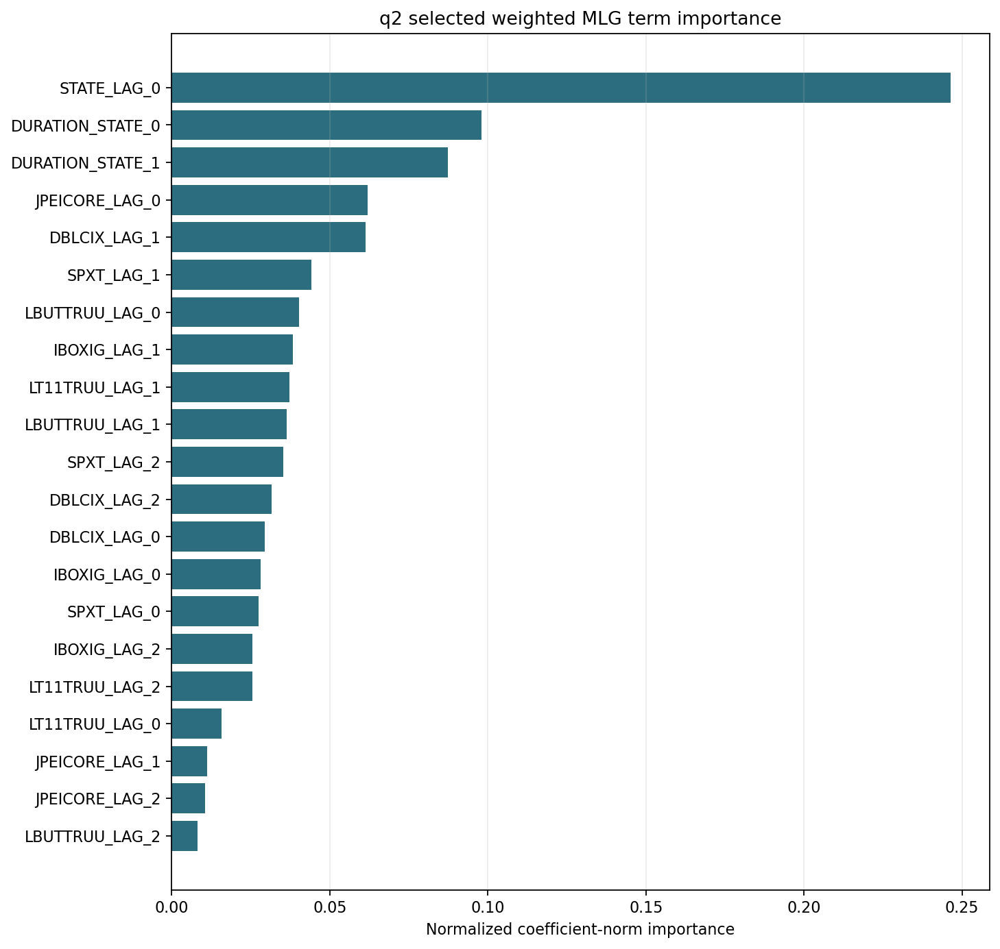

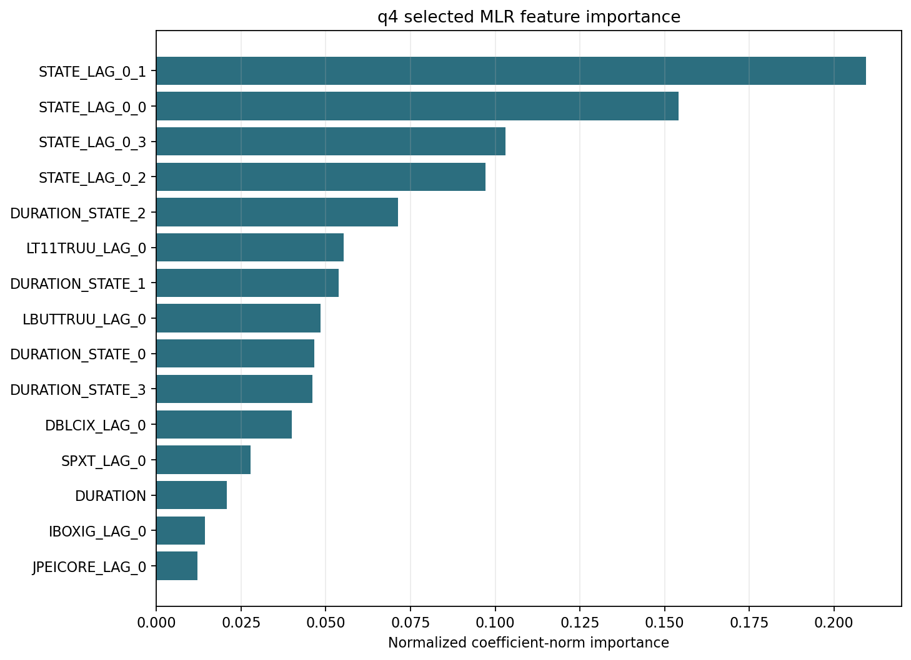

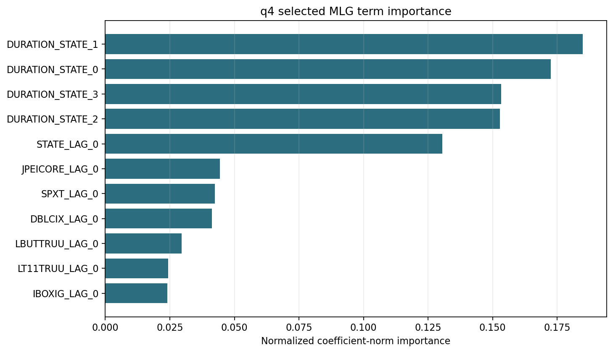

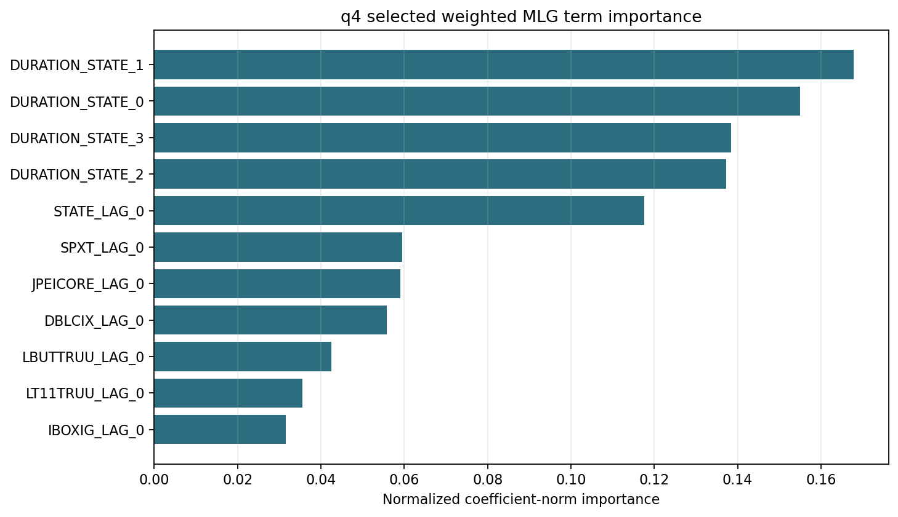

## Duration-Hazard Result

`p1_6_duration_hazard.py` tests a constrained model in which exit probability must rise with duration. The maximum-likelihood solution places all nonnegative hazard coefficients at zero for q2 and q4. Unconstrained diagnostic coefficients are negative, indicating decreasing exit hazard and increasing persistence.

The restricted aging model is therefore rejected as a replacement for the fixed transition matrix. Duration remains useful, but its empirical effect is closer to persistence than forced aging.

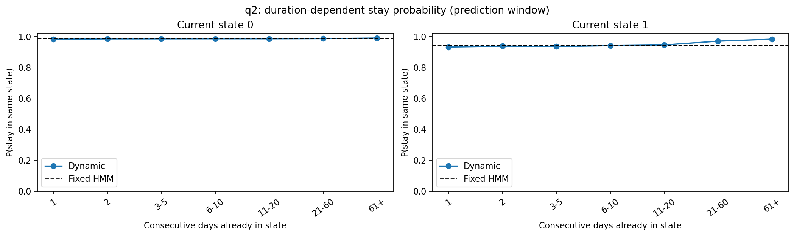

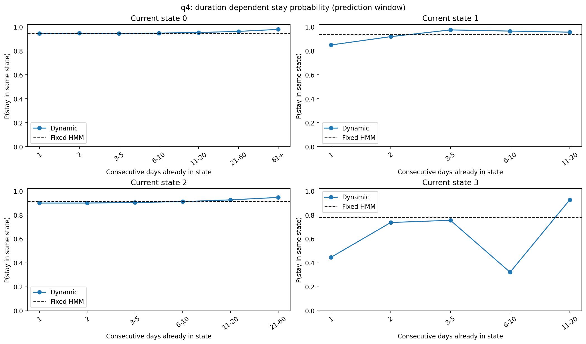

## Phase 2 And Phase 3 Backtesting Status

The repository implements WGAN training, return simulation, stylized-fact diagnostics, and VaR backtesting. `p3_3_risk_man.py` produces:

- Normal versus WGAN/HMM-WGAN VaR at 90%, 95%, 97.5%, and 99%
- Empirical VaR exceedance frequencies
- Average exceedance severity
- Average conservatism on non-exceedance days
- Rolling 250-day exceedance counts and limit plots

The current workspace does not contain a complete generated `phase_2/`, `simulations/`, `stylized_facts/`, or `risk_management/` result set. The README therefore does not report Phase 3 numerical backtest results. Formal Kupiec unconditional-coverage and Christoffersen independence tests are also not currently implemented; existing risk diagnostics are empirical exceedance backtests.

## Key Outputs

### HMM Diagnostics

```text
phase_1/hmm_gof_summary.csv
phase_1/hmm_regime_count_bootstrap.csv
phase_1/hmm_regime_count_recommendation.csv
phase_1/hmm_regime_stability.csv
phase_1/hmm_covariance_diagnostics.csv
phase_1/hmm_emission_normality.csv
phase_1/hmm_duration_geometric_diagnostics.csv
phase_1/hmm_residual_diagnostics.csv
phase_1/hmm_diagnostics_model_selection.png
phase_1/hmm_diagnostics_assumption_checks.png
```

### Transition Dynamics

```text
phase_1/hmm_transition_dynamics/filtered_state_probabilities_q*.csv
phase_1/hmm_transition_dynamics/transition_timing_model_comparison_q*.csv
phase_1/hmm_transition_dynamics/transition_timing_paired_tests_q*.csv
phase_1/hmm_transition_dynamics/transition_monotonicity_tests_q*.csv
phase_1/hmm_transition_dynamics/transition_calibration_q*.png
phase_1/hmm_transition_dynamics/transition_event_q*_from_*_to_*.png
```

### Transition Models

```text
phase_1/dynamic_transition_report_q*.csv
phase_1/mlg_transition_report_q*.csv
phase_1/weighted_mlg_transition_report_q*.csv
phase_1/pvalue_vif_mlr_transition_report_q*.csv
phase_1/pvalue_vif_mlr_selection_audit_q*.csv
phase_1/pvalue_vif_mlr_selected_significance_q*.csv
phase_1/pvalue_vif_mlr_selected_vif_q*.csv
```

### Five-Model Comparison

```text
phase_1/transition_comparison/transition_selected_oos_metrics_q*.csv
phase_1/transition_comparison/transition_selected_oos_metrics_q*.png
phase_1/transition_comparison/transition_prediction_probabilities_q*.csv
phase_1/transition_comparison/transition_matrix_summary.csv
phase_1/transition_comparison/transition_matrix_summary_mlg.csv
phase_1/transition_comparison/transition_matrix_comparison_mlg_q*.png
phase_1/transition_comparison/feature_importance_*.csv
phase_1/transition_comparison/feature_importance_*.png
phase_1/transition_comparison/mlg_partial_effects_q*/
phase_1/transition_comparison/weighted_mlg_partial_effects_q*/
```

Each probability-vector CSV contains fixed, MLR, P/VIF MLR, MLG, and weighted-MLG probabilities for every prediction date, together with row-sum checks and predicted next states.

## Recommended Phase 1 Run Order

The scripts locate inputs relative to the repository through `project_config.py`.

```powershell
python p0_1_raw_to_rets.py
python p1_0_hmm_params.py
python p1_1_best_params.py
python p1_2_hmm.py
python p1_7_hmm_diagnostics.py
python p1_8_hmm_transition_dynamics.py
python p1_4_mlg_transition.py
python p1_10_weighted_mlg_transition.py
python p1_11_pvalue_vif_mlr_transition.py
python p1_9_transition_feature_ablation.py
python p1_5_transition_comparison.py
```

The HMM seed search and diagnostic bootstrap are the expensive Phase 1 steps. `p1_5_transition_comparison.py` will load existing reports when available and create missing weighted-MLG or P/VIF-MLR reports automatically.

## Setup On Windows

Anaconda example:

```powershell
& 'C:\Users\namho\anaconda3\python.exe' -m pip install -r requirements.txt
```

Standard virtual-environment example:

```powershell
py -m venv .venv
.\.venv\Scripts\Activate.ps1
python -m pip install --upgrade pip
python -m pip install -r requirements.txt
```

Inputs are expected in `Inputs/`; processed files are written to `processed/`.

## Verification

Run the Phase 1 tests:

```powershell
python -m unittest test_p1_4_mlg_transition.py test_p1_7_hmm_diagnostics.py test_p1_8_hmm_transition_dynamics.py test_p1_9_transition_feature_ablation.py test_p1_10_weighted_mlg_transition.py test_p1_11_pvalue_vif_mlr_transition.py
```

The current suite contains 27 relevant Phase 1 tests. It includes checks that:

- Weighted MLG with unit group weights reproduces original MLG probabilities.
- Corrected lagged-state features are nonconstant.
- Exact multicollinearity is detected.
- Significant macros are protected from VIF removal.
- Model selection uses validation rather than prediction results.
- HMM transition, stability, covariance, duration, and residual diagnostics behave as intended.

## Repository Structure

| Path | Description |
|---|---|
| `Inputs/` | Raw input data; ignored by Git. |
| `processed/` | Processed prices and returns; ignored by Git. |
| `phase_1/` | HMM, transition-model, and diagnostic outputs. Selected result snapshots may be force-tracked. |
| `phase_2/` | WGAN training datasets; ignored by Git. |
| `models/` | WGAN weights; ignored by Git. |
| `simulations/` | Simulated returns; ignored by Git. |
| `stylized_facts/` | Phase 3 diagnostics; ignored by Git. |
| `risk_management/` | VaR backtest outputs; ignored by Git. |
| `docs/hmm_transition_results/` | Earlier GitHub-visible transition snapshots. |

Generated outputs are ignored by default to prevent accidental large commits. Research-result snapshots in this branch are intentionally force-added when they are needed for reproducibility and review.

## Interpretation Caveats

- HMM states are inferred latent labels, not directly observed economic states.
- Production q2 and q4 likelihoods are not directly comparable because their feature dimensions differ.
- Diagnostic q2/q3/q4 models are comparable to each other but are diagnostic-only and do not replace production labels.
- Coefficient-norm feature importance is basis- and regularization-dependent; it is not causal importance.
- Bootstrap p-values with 49 replications have minimum attainable value `0.02`.
- Sparse q4 stress-transition pairs should not be interpreted from event plots without checking event counts.
- The prediction-period transition comparison is a probability backtest, not an investable-strategy return backtest.
